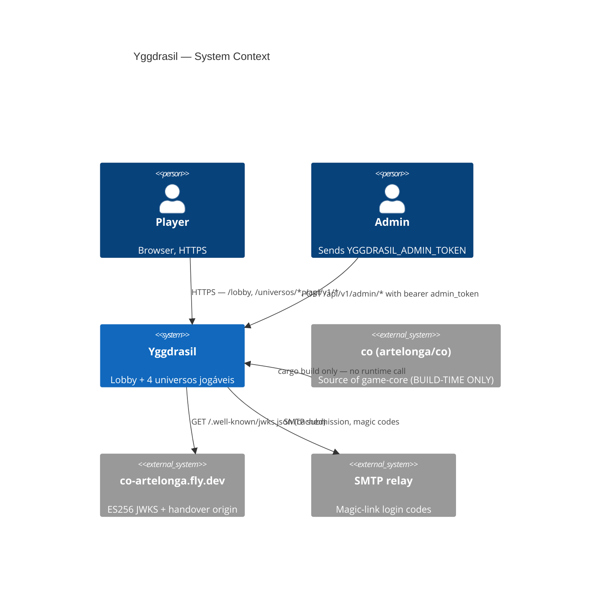
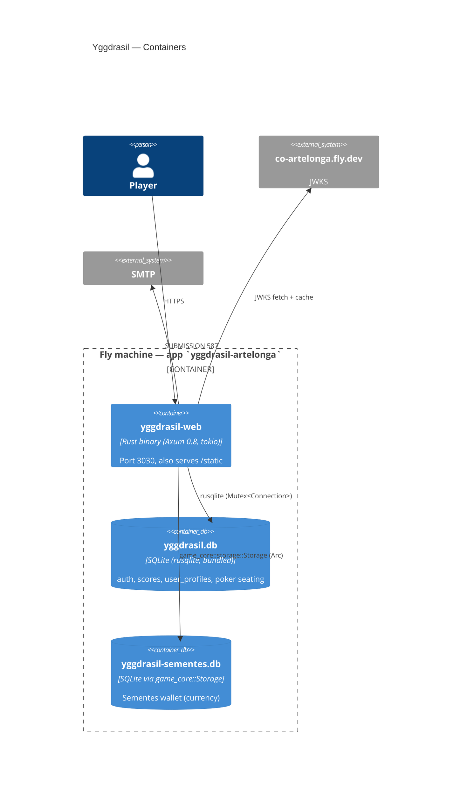
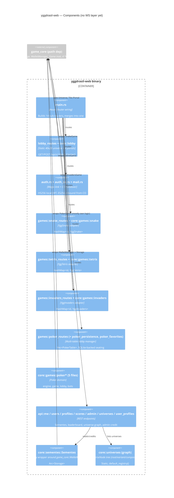

# Yggdrasil — Architecture (as-is)

> Snapshot at workspace `v0.9.0`. Audit only — no refactors performed.

Yggdrasil is a single-binary Rust web service (`yggdrasil-web`) backed by a
domain crate (`yggdrasil-core`). It serves a lobby + four mini-games
(snake, tetris, invaders, poker) over plain HTTP. **No WebSocket layer
exists yet** (despite the user-story brief; multiplayer surfaces today are
short-poll HTTP). The engine, plugins, and `Storage`/wallet primitives
come from `co/game-core` via a Cargo `path = "../co/game-core"` dep —
that path-dep is the only cross-repo coupling and is tracked by **YG-17**.

## 1. C4 — Context



Key invariants:

- No inbound traffic from other Fly tasks. Players only.
- `co` is **build-time** only — once compiled, the binary is self-contained.
- `co-artelonga.fly.dev` is consulted at runtime **only** for JWKS verification
  during the `/auth/co-handover-receive` flow. No data is pushed to co.

## 2. C4 — Containers



Notes:

- **Both DBs live on the same Fly volume** (`/data`), mounted via `[mounts]`
  in `fly.toml` (`yggdrasil_data` → `/data`). Filenames default to
  `yggdrasil.db` and `yggdrasil-sementes.db`; overridable via env.
- The "per-game SQLite databases" framing in the brief is **not** how it
  actually works: snake/tetris/invaders/poker all share the single
  `yggdrasil.db` (table `scores`, plus poker's own tables). There is no
  per-game DB file. The only second DB is `sementes` (currency wallet),
  which is segregated because it's owned by `game_core::Storage`.
- Per-game in-memory state (`Mutex<HashMap<session_id, YggSnake>>`, etc.)
  lives in the process and is lost on restart **except** for poker, which
  YG-29 made durable via `poker_persistence`.

## 3. C4 — Components



### WebSocket session layer

**Does not exist.** Poker multiplayer is implemented as HTTP polling
(`GET /api/v1/poker/lobbies/{id}/hand` + `POST .../action`). The
`tokio::sync::broadcast`/`mpsc`/`watch` channels that a WS layer would
require are entirely absent from both crates. Adding a WS layer is implicit
in the user-story but **not represented in code today**.

## 4. Rust module dep graph

```mermaid
graph TD
  subgraph yggdrasil_web
    main_rs[main.rs]
    auth[auth.rs]
    auth_co[auth_co.rs]
    mail[mail.rs]
    lobby_routes[lobby_routes.rs]
    games_mod[games/mod.rs]
    common[games/common.rs]
    snake_r[games/snake_routes.rs]
    tetris_r[games/tetris_routes.rs]
    invaders_r[games/invaders_routes.rs]
    poker_r[games/poker_routes.rs]
    poker_pers[games/poker_persistence.rs]
    poker_fav[games/poker_favorites.rs]
    api_mod[api/mod.rs]
    api_admin[api/admin.rs]
    api_me[api/me.rs]
    api_scores[api/scores.rs]
    api_users[api/users.rs]
    api_profiles[api/profiles.rs]
    api_universes[api/universes.rs]
    api_user_profiles[api/user_profiles.rs]
  end
  subgraph yggdrasil_core
    core_lib[lib.rs]
    core_lobby[lobby.rs]
    core_sementes[sementes.rs]
    core_universes[universes.rs]
    core_games[games/mod.rs]
    core_snake[games/snake.rs]
    core_tetris[games/tetris.rs]
    core_invaders[games/invaders.rs]
    core_poker[games/poker.rs]
    core_poker_lobby[games/poker_lobby.rs]
    core_poker_engine[games/poker_engine.rs]
    core_poker_game[games/poker_game.rs]
    core_poker_bot[games/poker_bot.rs]
  end
  game_core[(game_core - path dep)]

  main_rs --> auth & auth_co & mail & lobby_routes & games_mod & api_mod
  main_rs --> core_sementes & core_universes
  auth --> mail
  lobby_routes --> core_lobby
  games_mod --> snake_r & tetris_r & invaders_r & poker_r & poker_pers & poker_fav & common
  snake_r --> common --> auth
  tetris_r --> common
  invaders_r --> common
  poker_r --> poker_pers & poker_fav & common & auth & core_sementes & core_poker_lobby & core_poker_game
  api_mod --> api_admin & api_me & api_scores & api_users & api_profiles & api_universes & api_user_profiles
  api_me --> core_sementes & core_universes
  api_universes --> core_universes
  core_lib --> core_lobby & core_sementes & core_universes & core_games
  core_games --> core_snake & core_tetris & core_invaders & core_poker
  core_poker --> core_poker_lobby & core_poker_engine & core_poker_game & core_poker_bot
  core_lobby --> game_core
  core_snake --> game_core
  core_tetris --> game_core
  core_invaders --> game_core
  core_poker --> game_core
  core_sementes --> game_core
  main_rs --> game_core
```



**Cycles:** none detected. The graph is a DAG. `yggdrasil-web` → `yggdrasil-core`
is one-way; `yggdrasil-core` → `game_core` is one-way; no module imports
upward.

## 5. Cross-repo coupling — the path dep

`Cargo.toml:18`:

```toml
game-core = { path = "../co/game-core" }
```

`fly.toml:1-9` documents that this forces deploys to be run from the
parent directory so the Docker build context includes `co/game-core`.
The same comment notes the migration to a git-rev pin is tracked by
**YG-17** (`type:chore`, priority high, release 0.5.0).

**Surface area of the coupling** — every module that touches the engine:

- `yggdrasil-core/src/lib.rs` (re-exports `game_core::engine::*` and `games::*`)
- `yggdrasil-core/src/lobby.rs` (`Universe`, `Tile`, `Objective`)
- `yggdrasil-core/src/sementes.rs` (`Storage`, `WalletManager`)
- `yggdrasil-core/src/games/{snake,tetris,invaders,poker,poker_game,...}.rs`
  (each wraps the matching `*Game` from `game_core::games`)
- `yggdrasil-web/src/main.rs` (`game_core::storage::Storage::open` directly)
- `yggdrasil-web/src/lobby_routes.rs` (matches on `Tile::Portal`)
- `yggdrasil-web/src/games/snake_routes.rs` (`Direction`, `Input`, `Universe`,
  `GameAction`)

If `game-core`'s public types change shape, the blast radius is wide —
roughly every game adapter file plus `main.rs`. The re-export shim in
`core/lib.rs::engine` and `::upstream_games` partially insulates
**application** code but **not** `yggdrasil-core` itself.

## 6. Drift notes (audit findings called out for the refactor plan)

1. The brief says "per-game SQLite databases" — reality is one shared
   `yggdrasil.db` (+ separate sementes DB). The mental model in YG tasks
   should be updated, or the schema should be split per game.
2. The brief says "WebSocket session layer" — that layer is not present.
   Poker is HTTP polling. Adding WS is unscoped work.
3. `make_*_state` (snake/tetris/invaders) each open their own
   `rusqlite::Connection` to the same `yggdrasil.db` file. Four `Mutex<Connection>`
   for one DB — works but is per-game segregation by accident, not design.
4. `auth.rs` is 630 lines, `api/me.rs` is 625 lines, `poker_routes.rs` is
   1189 lines. Each carries its own tests inline; live SRP risk listed in
   the refactor plan.
