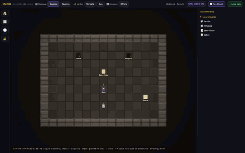
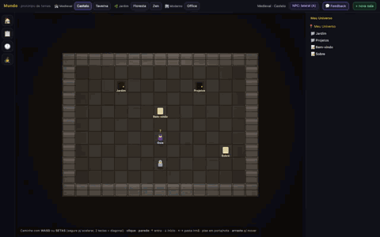
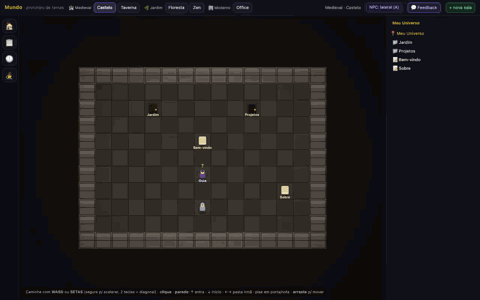

# O Mundo (`/mundo`) — universo caminhável

> O **Mundo** é o protótipo do universo caminhável do Yggdrasil (YG-146): seu
> universo de notas vira um **espaço 2D que você atravessa a pé**. Cada **pasta
> é uma sala** em que você entra de verdade; cada **nota é um objeto** no chão
> que você abre e edita. Acesse em **`/mundo`** (sem login) — o tema vem na URL
> (`/mundo?tema=garden-zen`) e fica salvo no navegador.
>
> Esta página documenta os **controles**, o **modelo pasta=sala / nota=objeto**,
> os **5 temas**, o **NPC** e o **modelo de dados (instance model)** — com
> **animações** das jornadas-chave, pra você entender o Mundo **sem rodar nada**.

- **Rota**: `GET /mundo` → `yggdrasil-web/src/main.rs::serve_mundo` (serve a página
  estática, preservando `?tema=`).
- **Frontend** (`<canvas>` + JS vanilla, sem framework): `yggdrasil-web/static/universos/`
  - `mundo-proto.html` — layout (ferramentas · palco/canvas · árvore).
  - `mundo/engine.js` — motor 2D (movimento, colisão, câmera, drag, navegação por borda).
  - `mundo/proto.js` — cola (salas, interações, NPC, seletor de tema, árvore viva).
  - `mundo/themes.js` — os 5 temas (como desenhar chão/parede/porta/nota/NPC/avatar).
  - `mundo/sample.js` — hierarquia de salas de exemplo (mock; no produto vem do `InstanceStore`).
  - `mundo/tutorial.md` — conteúdo determinístico do NPC.

> ℹ️ O protótipo é **100% client-side**: os dados são mock (`sample.js`) e as
> chamadas de backend (NPC, feedback, telemetria) têm *fallback*. Por isso as
> animações abaixo são gravadas servindo só os arquivos estáticos — sem subir o
> workspace Rust.

---

## Jornadas (animações)

As GIFs abaixo são geradas por Playwright (ver [Como regenerar](#como-regenerar-as-gifs))
e entram no **DoD** das fatias do Mundo como **prova visual**.

### 1. Andar

Caminhe pela sala com **WASD/setas** (ou clique). A câmera segue o avatar.



### 2. Entrar numa sala (pasta = sala)

Pise na **porta** de uma pasta (ex.: *Jardim*) e você **entra na sala** — a
trilha (breadcrumb) e a árvore viva atualizam. Para voltar, pise no tile **↑ voltar**.


### 3. Abrir e editar uma nota (nota = objeto)

Abra a nota (pise no objeto, aperte **Enter** em cima dele, ou **clique no item
da árvore**), edite o texto e **💾 Salvar**.



### 4. Arrastar e soltar (reposicionar)

**Arraste** uma nota para **reposicioná-la** (a posição é o "estado" da sala).
Se soltar **sobre uma porta**, a nota é **movida pra dentro daquela pasta**
(reparent) e a árvore atualiza na hora.



---

## Controles

| Ação | Como |
|---|---|
| Andar | **WASD** ou **setas**. **Segure** para acelerar (de 9,5 a 16 tiles/s); **duas teclas** (ex.: `W`+`D`) andam na **diagonal**. |
| Ir a um ponto | **Clique** num tile — o avatar traça o caminho (BFS) e vai quase na hora. |
| Interagir | **Pise** numa porta/nota/NPC, ou aperte **Enter** em cima da entidade. |
| Arrastar | Segure o clique sobre uma **nota** (ou porta) e mova: **reposiciona**; soltar **sobre uma porta** faz **reparent**. |
| Fechar painel/overlay | **Esc**. |

### Navegação por parede (andar contra a borda)

Andar **de encontro à borda** da sala navega a hierarquia (sem precisar achar a
porta) — útil no teclado:

| Borda | Ação |
|---|---|
| **↑ topo** | **entra** na primeira subpasta (mais fundo). |
| **↓ baixo** | volta ao **Início** (sala raiz / índice). |
| **← →** laterais | cicla entre as **pastas irmãs**. |

> Implementação: `engine.js::_edge()` dispara `proto.js::onEdge(dir)` com um
> *lock* de 350 ms para não repetir ao segurar a tecla.

---

## Modelo: pasta = sala, nota = objeto

O Mundo é **recursivo**: o universo é a **sala raiz**; cada **pasta** é uma
**porta** para uma sub-sala; cada **nota** é um **objeto pisável**; e o **NPC**
é um personagem. A mesma hierarquia aparece, espelhada, na **árvore viva** à
direita e na **trilha** (breadcrumb) no topo da sidebar.

| No Mundo (2D) | No modelo | Glossário |
|---|---|---|
| Sala em que você anda | sala/nó da hierarquia | **universo** / pasta |
| Porta | aresta para sub-sala | **pasta** = sala |
| Objeto no chão | item de conteúdo | **nota** (`artigo` · `indice` · `pasta`) |
| Objeto com selo de status | nota + `status` | **tarefa** (`todo` · `doing` · `done`) |
| Tile **↑ voltar** | aresta para a sala-mãe | retorno |
| Personagem | guia/ajuda | **NPC** |

> Uma **nota vira tarefa** só por ganhar `status` (`todo`/`doing`/`done`) — sem
> tipo novo (composição, YG-130). É por isso que o **📋 Quadro (Kanban)** agrega
> as tarefas de **todas as salas** e a **🕐 Linha do tempo** lista tudo.

### Ferramentas do lobby (barra à esquerda)

- **🏠 Início** — volta à sala raiz.
- **📋 Quadro (Kanban)** — tarefas (notas com status) de todas as salas, em colunas.
- **🕐 Linha do tempo** — lista plana das notas/tarefas (no produto, eixo temporal real).
- **🧙 Guia (NPC)** — abre o painel do NPC (posição A/B: lateral ou fixo no topo).

---

## Os 5 temas

O tema muda **forma e arte**, não só cor: chão, paredes, portas, objetos e
personagens são próprios de cada um. Troque no seletor do topo; a escolha vai
na URL (`?tema=<id>`) e fica salva no navegador. O tema atual também **marca o
feedback** enviado (`POST /api/v1/feedback`, `kind: "tema:<id>"`).

| `id` | Rótulo | Família |
|---|---|---|
| `medieval-castle` | Medieval · Castelo | 🏰 Medieval |
| `medieval-tavern` | Medieval · Taverna | 🏰 Medieval |
| `garden-forest` | Jardim · Floresta | 🌿 Jardim |
| `garden-zen` | Jardim · Zen | 🌿 Jardim |
| `modern-office` | Moderno · Office | 🏢 Moderno |

---

## NPC (o **Guia**)

O Guia conhece os tutoriais do Mundo (`mundo/tutorial.md` — cada `##` vira um
tópico) e responde de dois jeitos:

1. **LLM local (Ollama)** via `POST /api/v1/npc` (`{ q, universo }`) — quando o
   backend está ligado, responde perguntas livres usando o contexto da sala.
2. **Determinístico** (sempre disponível, sem backend) — casa as palavras da
   pergunta com os tópicos do `tutorial.md`. É o *fallback*.

Tópicos atuais: andar/entrar em salas, interagir com notas, o que é sala/pasta,
arrastar e soltar, editar texto, o que muda nos temas, e quem é o NPC.

---

## Modelo de dados (instance model)

No protótipo, as salas vêm de `sample.js` (mock). **No produto**, o Mundo lê do
**instance model** — o mesmo do editor de universos data-driven (ver
[`architecture/editor.md`](architecture/editor.md)). Dois lados **disjuntos**:
o **layout** (posições, em JSON) e o **conteúdo canônico** (Markdown em disco).

### `InstanceStore` — layout + blobs (`yggdrasil-core/src/instance/store.rs`)

- **Disco é a fonte da verdade** (modelo do `co`): cada instância é uma pasta
  `<root>/<id>/`, com `instance.json` (o grafo de layout) e `notes/` (o conteúdo).
- **Escrita atômica** (temp + `rename`) — sem corromper em escrita parcial.
- **Blobs content-addressed**: anexos vão para `_blobs/<shard>/<hash>` por SHA-256.
- Listagens: `list_all` (por `updated_at` desc), `list_owner` (por `sub` do JWT),
  `list_published` (feed público).

O grafo é o `UniverseInstance` (`schema.rs`): `grid` (`GridSpec`), `projection`
(`TwoDGrid` · `Isometric` · `Timeline`), `layers` (z-ordenadas) e `connections`.
Cada **`Layer`** carrega **`Block`s**, e cada `Block` tem:

```rust
pub struct Block {
    pub id: String,
    pub block_type: String,           // chave da paleta: "note", "landmark", "portal"…
    pub pos: Cell,                    // posição na GRADE (não em pixels): { x, y }
    pub label: Option<String>,
    pub attachments: Vec<ContentRef>,
    pub props: BTreeMap<String, Value>, // ex.: { "note_slug": "bem-vindo" }
}
```

### A posição `pos{room, x, y}`

A posição de um objeto no Mundo é **layout** (estado da sala), não conteúdo:

- **`room`** — em qual **sala** o objeto está. No `instance.json` é a **`Layer`**
  (sala = camada da hierarquia); no mock (`sample.js`) é o `id` da sala.
- **`x`, `y`** — a célula na **grade** (`Block.pos: Cell`), em tiles — **não** em
  pixels. É o que o `drag-drop` reposiciona, e o que o reparent move de sala.

Como é layout, a posição mora no **JSON** — nunca no `.md`. Mover/reposicionar
um objeto **não toca** o conteúdo canônico da nota.

### `NoteStore` — conteúdo canônico (`yggdrasil-core/src/instance/note.rs`)

- Uma **`notes/<slug>.md`** por nota, sob `<root>/<id>/notes/`. **Markdown é
  canônico**; o `Block` referencia a nota por `props.note_slug`.
- Frontmatter YAML + corpo verbatim — no mesmo padrão das *Entries* do `co`:

  ```markdown
  ---
  type: nota
  slug: bem-vindo
  title: "Bem-vindo"
  status: todo            # presente só quando a nota é tarefa (composição)
  created: "2026-06-14T12:00:00Z"
  updated: "2026-06-14T12:30:00Z"
  links:
    - "[[sobre.md]]"      # wikilinks de saída (resolvidos a slug; invertidos em backlinks)
  contributed_via: yggdrasil-instance
  ---
  # Bem-vindo ao seu universo
  …corpo Markdown…
  ```

- `status: Some(..)` torna a nota uma **tarefa**; `None` é a nota pura (jardim) —
  **mesma struct, mesmo arquivo**.
- **Wikilinks** `[[slug]]` / `[[slug|alias]]` no corpo seguem a semântica do `co`
  (porte de `co/core/src/wikilink.rs`), com **backlinks** invertidos.

### Por que dois lados disjuntos — e a relação com o CO

O `co` edita **corpo/links** (Markdown); o Yggdrasil mantém **posições** (JSON).
Como os dois lados não se sobrepõem, **não há merge**: é o que torna uma nota
**promovível a sub-universo** só **movendo o arquivo**, sem re-plumbing.

A ponte com o **CO** é por eventos (ver
[`architecture/event-driven-sync.md`](architecture/event-driven-sync.md)): as
notas são federáveis ao mural/Agora do CO via `FederatedEvent` sobre o
barramento (CO-383 *ingest* → CO-384 ponte WS → CO-385 *UPSERT*). O **feedback**
do Mundo também vai pro CO (`POST /api/v1/feedback`, marcado com o tema atual).

---

## Como regenerar as GIFs

O gerador vive no setup Playwright existente (`e2e/`). Ele sobe um servidor
estático mínimo, grava cada jornada em vídeo (`recordVideo`), extrai frames já
reduzidos (480px) e monta um GIF otimizado (paleta de 64 cores, 8 fps) em
`docs/mundo/`:

```bash
cd e2e
npm install          # instala @playwright/test + gifenc + pngjs
npx playwright install chromium   # se ainda não tiver o browser
npm run gifs         # gera docs/mundo/*.gif
```

As jornadas estão em `e2e/mundo-gifs.mjs` (`JORNADAS`): `andar`, `entrar_sala`,
`abrir_editar_nota`, `drag_drop`. Os `.webm` intermediários (`e2e/.videos/`) são
temporários e ignorados pelo git; só os GIFs finais são versionados.
